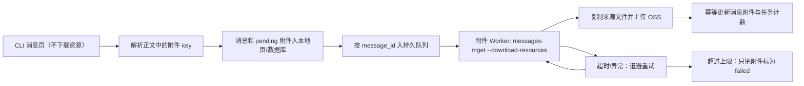

# 飞书 CLI 消息与附件解耦设计

## 1. 场景与目标

当前运行场景是单机、单 Windows 用户、低并发的内部采集工具。Lark CLI 用户凭据由当前 Windows
用户的安全存储管理。一次历史采集可能覆盖一年以上，并包含数 GB 的附件。

现状把 `+chat-messages-list --download-resources` 作为单页命令；任一超大附件超过 180 秒会让整页
消息失败。已确认 `+messages-mget` 支持根据已知 `message_id` 单独下载资源，而不下载资源的消息响应
仍包含可解析的附件 key。

本次目标：

1. 消息分页命令不下载附件，页面返回后立即持久化消息和附件占位状态。
2. 附件按消息进入持久队列，由后台 Worker 独立下载、上传 OSS、更新数据库和本地页文件。
3. 附件超时、网络异常或 OSS 异常不回滚消息，不阻塞后续附件。
4. API 重启后把 `running` 附件任务恢复为 `pending` 并继续处理。
5. 当前单机使用文件队列；队列接口保持独立，未来多实例时迁移到 PostgreSQL `SKIP LOCKED` Worker。

## 2. 非目标

- 不实现多机器同时消费同一队列。
- 不读取、导出或自行刷新 Lark CLI Token。
- 不承诺所有超大附件必然成功；超过超时或重试上限时明确标记失败，但消息必须可用。
- 不自动删除旧任务目录中的历史文件；只清理新 Worker 自己创建的临时尝试目录，以及正在恢复页中
  未完成的旧 CLI 临时目录。

## 3. 数据与状态

### 3.1 消息附件

`TimelineAttachment.status` 新增 `pending`，`storageStatus` 新增 `pending`：

- `pending`：已从消息正文发现附件 key，等待 Worker。
- `downloaded/reused`：来源文件已得到。
- `failed/unavailable`：达到重试上限或来源不可用。
- `storageStatus=uploaded`：OSS 已完成。
- `storageStatus=upload_failed`：来源成功但 OSS 失败。

`CollectionJob` 新增：

- `attachmentPendingCount`：仍待处理的附件引用数。
- `attachmentProcessedCount`：已经完成来源下载及 OSS 处理的附件引用数。

`attachmentCount` 仍表示总引用数，`attachmentFailedCount` 只计最终失败，不把 `pending` 当失败。

### 3.2 持久队列

每个任务保存 `jobs/<jobId>/attachment-queue.json`：

```json
{
  "version": 1,
  "profile": "dlr-history-...",
  "items": [{
    "messageId": "om_...",
    "pageNumber": 6,
    "status": "pending",
    "attempts": 0,
    "nextAttemptAt": "",
    "error": "",
    "updatedAt": "..."
  }]
}
```

同一任务内以 `messageId` 幂等。写入使用临时文件 + rename。进程重启时 `running` 重置为 `pending`。
下载成功后，队列项会先保存附件本地路径，再执行 OSS/数据库持久化；后者失败时复用本地文件，不重新下载大附件。

## 4. 执行流程



主消息抓取结束后即可把消息任务标为 `completed`；有 pending 时页面显示“消息完成，附件后台处理中”。
Worker 清空队列后：无失败保持 `completed`，有最终失败改为 `partial`。主消息抓取自身失败仍为 `failed`。

## 5. 超时与重试

- 消息页 CLI 超时：默认 180 秒，但不再包含附件下载。
- 单消息附件 CLI 超时：默认 30 分钟，通过 `FEISHU_CLI_ATTACHMENT_TIMEOUT_MS` 配置。
- 最大尝试：默认 3 次，通过 `FEISHU_CLI_ATTACHMENT_MAX_ATTEMPTS` 配置。
- 退避：测试可注入；生产使用 5 秒、30 秒、2 分钟级别的有限退避。
- Worker 并发：当前固定为 1，避免同一文件队列和本地任务计数发生并发写冲突；未来迁移 PostgreSQL 队列后再开放多消费者并发。
- 每次尝试使用独立临时目录；完成或失败后清理该目录，避免每次重试残留数 GB `.tmp`。

## 6. 幂等、重启与失败边界

- 消息页继续用 `message_id`、附件继续用 `(message_id,file_key)` 幂等 upsert。
- Worker 更新附件时不推进消息分页令牌，不增加消息数或总附件数。
- API 重启不会重新抓已保存消息页；队列从文件恢复。
- Worker 找不到消息、profile 或附件 key 时记录最终错误，不修改其他消息。
- OSS 上传失败可重试同一消息任务；已上传到目标 bucket/object key 的附件可复用。
- 任务恢复页开始前清理该页尚未提交的旧 `cli-pages/<page>` 临时目录；已提交页不动。

## 7. 页面表现

- 任务指标增加“附件待处理”和“附件已处理”。
- pending 附件显示“后台处理中”，不能当成来源失败。
- 页面轮询发现附件计数变化时重新读取当前任务消息，使图片/文件无需重新打开任务即可出现。
- 最终失败展示附件级错误；任务顶部状态为“部分数据异常”，消息正文继续展示。

## 8. 验收标准

1. 主消息页 CLI 命令不含 `--download-resources`，50 条消息能在附件未下载时先写入。
2. 正文中的 image/file/audio/video/media key 被去重解析为 `pending`，贴纸不进入队列。
3. 每个含 pending 附件的 message 只创建一个队列项，重复入队不重复处理。
4. Worker 使用 `+messages-mget --message-ids <id> --download-resources --no-reactions`。
5. 3GB 附件超过消息页 180 秒不再导致消息任务失败；消息可在内部数据中查询。
6. 单消息附件超时会退避重试，达到上限后只把对应附件标为 failed，继续下一项。
7. API 重启后 running 队列项恢复 pending，已完成项不重复下载。
8. Worker 更新附件不改变 `pages/messageCount/nextPageToken`，pending/processed/failed 计数准确。
9. OSS 上传成功后内部数据返回签名 URL；pending 和失败不会生成伪 URL。
10. 页面展示 pending/processed 指标和“后台处理中”，附件完成后自动刷新当前时间线。
11. 临时尝试目录在成功和失败后均清理；旧未完成页在恢复前清理，不持续累积 GB 级 `.tmp`。
12. 机器人采集链路行为不变。
13. 单元测试、Python 测试、`pnpm typecheck`、`pnpm build` 全部通过。
14. 非沙盒真实流程走通“继续失败任务 → 消息页越过原第 6 页 → 附件后台处理”，失败步骤明确列出。
