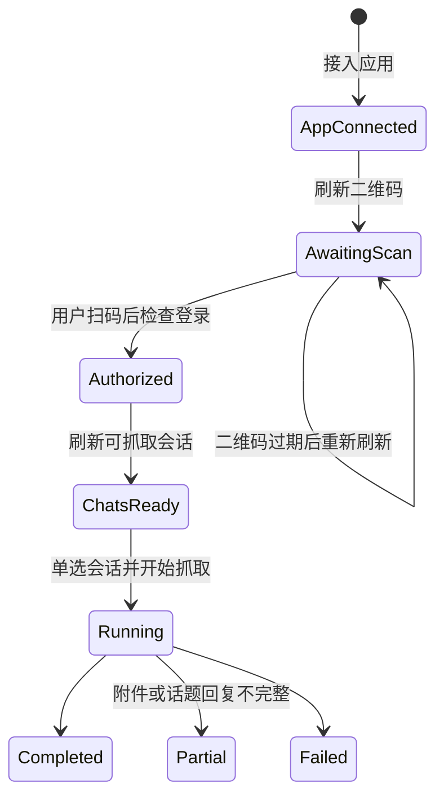

# 飞书官方 Lark CLI 用户身份采集接入设计

## 1. 目标与第一版边界

在现有“飞书历史采集”页面增加机器人/CLI 滑轨切换。机器人链路继续使用
`tenant_access_token`；CLI 链路调用本机已安装的官方 `@larksuite/cli`，固定使用
`--as user`，读取当前授权用户可访问的群聊和单聊。

第一版场景为单机、单操作人、单会话选择、低并发。支持：

1. 输入 App ID 和 App Secret，将应用接入项目专用 CLI profile。
2. 刷新设备授权链接和二维码。
3. 用户扫码后确认登录，服务端验证实际身份为 `user`。
4. 刷新授权用户可访问的群聊和单聊。
5. 单选一个会话和北京时间范围，逐页抓取消息与附件。
6. 复用机器人链路的任务、消息、附件、PostgreSQL 和私有 OSS 存储。
7. CLI 采集的 `p2p` 数据进入“飞书单聊”，`group/topic` 进入“飞书群组”。

第一版不支持多选会话、多人并发、跨机器 Token 同步、表情回应入库，也不承诺读取
飞书 API 当前可见范围之外的历史消息。

## 2. 已确认的运行契约

- 本机命令：`lark-cli.cmd`。
- 实测版本：`@larksuite/cli 1.0.88`；页面和 API 返回实际探测版本，不硬编码为可用性判断。
- 会话枚举：

  ```text
  lark-cli im +chat-list --as user --types=p2p,group --page-all --page-limit 1000 --format json
  ```

- 消息抓取：按 50 条一页显式传递 `page_token`，使用 `--no-reactions` 和
  `--download-resources`。结束条件必须是 `has_more=false`，不能只依据退出码 0。
- 最小用户权限：

  ```text
  im:chat:read
  im:message:readonly
  im:message.group_msg:get_as_user
  im:message.p2p_msg:get_as_user
  im:message.reactions:read
  ```

  `@larksuite/cli 1.0.88` 的 `im +chat-messages-list` 即使传入
  `--no-reactions`，仍会在用户授权预检阶段要求
  `im:message.reactions:read`。快速兼容方案在 OAuth 登录时一并请求该只读权限，
  但抓取命令继续保留 `--no-reactions`，业务不会获取、保存或展示表情回应数据。
  已有 profile 必须重新完成一次包含该 scope 的用户授权；仅在开发者后台开通权限
  不会改变已经签发的用户 Token。后续若改为直接调用原始消息 API，可重新评估并移除
  该兼容权限。

- 业务 scope 列表不手工拼接 `offline_access`；官方 CLI 的 OAuth 登录会在实际授权结果中携带
  `offline_access`，并使用 Windows 密钥链中的 refresh token 自动续期短期 access token。
  系统以 `auth status --verify` 的真实结果为准，不自行读取、保存或刷新 Token。附件下载不预设
  额外 `im:resource`，以真实 `missing_scope` 结果为准。

## 3. 身份模型与映射结论

| 维度 | 机器人采集 | CLI 采集 | 统一规则 |
|---|---|---|---|
| 采集器 | `robot` | `cli` | 每个任务显式记录 |
| 调用身份 | `bot` | `user` | 不允许 CLI 回退为 bot |
| Token | `tenant_access_token` | `user_access_token` | 不写入任务、数据库或日志 |
| 可见范围 | 机器人已加入群 | 授权用户可访问会话 | 不声称二者等价 |
| 会话主键 | `chat_id` | `chat_id` | 同一 App 命名空间内使用 |
| 消息主键 | `message_id` | `message_id` | 继续作为幂等键 |
| 发送者主键 | 普通用户为 `open_id` | 普通用户为 `open_id` | 不做 `user_id/open_id` 猜测转换 |
| 发送者姓名 | 成员表补全 | 消息响应 `sender.name` | CLI 优先使用官方输出姓名 |
| 附件接口 | message resource | message resource | 统一进入现有附件存储 |

`open_id` 与 App ID 绑定。任务新增 `appNamespace`，值为 App ID 的不可逆 SHA-256
摘要，不保存 App Secret，也不把不同 `appNamespace` 的发送者 ID 当成同一身份。
历史任务兼容为 `collectorType=robot`、`callerIdentity=bot`、空命名空间。

## 4. 应用接入和凭据安全

CLI 应用接入使用：

```text
lark-cli config init --app-id <id> --app-secret-stdin --brand feishu --lang zh_cn --name <profile>
```

App Secret 只通过子进程 stdin 传入，不进入 argv、响应体或日志。profile 名由 App ID
摘要生成，避免不同应用相互覆盖。

Windows 运行约束：官方 CLI 1.0.88 使用 DPAPI + 当前用户注册表
`HKCU\\Software\\LarkCli\\keychain` 保存 App Secret 和用户 OAuth Token。API 服务必须由
当前交互登录用户启动，并对该注册表位置具备读写权限。CLI 提示的 `file:` 引用只能绕过
App Secret 的密钥链写入；用户 access/refresh token 仍然强制使用密钥链，因此本项目禁止把
明文 secret 文件作为自动降级方案。检测到 `keychain unavailable`、`registry create/open failed`
或 `Access is denied` 时，应中止接入并提示用户以当前 Windows 用户上下文重启 API 服务。

与机器人链路不同，官方 CLI 会把应用凭据和用户 Token 写入它自己的 profile/Windows
系统凭据存储，以便完成 OAuth Token 交换。页面必须明确提示这一事实，不能继续使用
“Secret 仅驻留服务端内存”的文案。项目自身仍不得把 Secret 或 Token写入任务 JSON、
数据库、浏览器存储或 Git。

## 5. 登录二维码状态机



刷新二维码调用：

```text
lark-cli auth login --scope "<最小权限>" --no-wait --json
lark-cli auth qrcode <verification_url> --output qrcode.png
```

`device_code` 只保存在服务端内存，浏览器只得到授权链接、二维码地址、过期时间和
随机 `authSessionId`。完成授权时服务端用该 `device_code` 调用 CLI，再执行
`auth status --json --verify`。只有 `identity=user` 且用户身份可用时才能刷新会话。

二维码过期、服务重启或登录会话不存在时必须重新刷新，不复用旧 device code。

### 5.1 长期登录恢复

长期登录分为两层，不能把页面的临时连接与飞书用户授权混为一谈：

- **CLI profile 与用户授权**：由官方 CLI 存在当前 Windows 用户的 DPAPI/注册表密钥链中；只要
  refresh token 仍有效且未被用户或管理员撤销，API 重启不应要求重新扫码。
- **页面连接**：`connectionId` 只是在 API 内存中指向 profile 的短期句柄。服务重启会丢失该句柄，
  但不得据此判断飞书登录已经失效。

浏览器只允许持久化非敏感的 App ID，键名为版本化的项目专用键；不得持久化 App Secret、Token、
device code、授权链接或 profile 内部内容。CLI 页面打开时，使用 App ID 调用恢复接口；服务端由同一
App ID 确定性推导 profile，执行 `auth status --json --verify`，并签发新的 `connectionId`：

- `identity=user` 且状态有效：自动恢复用户名并刷新会话，不展示扫码步骤。
- profile 存在但用户授权真实失效：保留应用连接，进入刷新二维码流程。
- profile 不存在、App 配置不可读或密钥链不可用：恢复失败，回到 App ID/Secret 接入步骤，并展示
  可区分的应用连接错误。

旧版本尚未保存 App ID 时，页面必须提供“只用 App ID 恢复已有应用”的一次性迁移入口；恢复成功后
才把该 App ID 写入浏览器。不得为了补齐浏览器记录而要求重新输入 App Secret 或重新扫码。

连接默认使用 24 小时滑动过期时间，每次成功访问都会续期；即使内存连接最终过期，页面也应通过
已保存的 App ID 重新签发连接，而不是要求再次输入 App Secret。设备授权挑战仍只在内存中保存且
保持短时有效，服务重启后不得恢复旧挑战。

## 6. API 设计

### 6.1 CLI 接入

- `POST /api/feishu/cli/connections`
  - 输入：`appId`、`appSecret`
  - 输出：`connectionId`、CLI 版本、连接过期时间、脱敏登录状态
- `POST /api/feishu/cli/connections/restore`
  - 输入：仅 `appId`
  - 输出：由既有 CLI profile 重新签发的 `connectionId` 和经验证的脱敏登录状态
  - 不接收 App Secret，不返回 Token；用于页面重开、API 重启和临时连接过期后的恢复
- `POST /api/feishu/cli/connections/:id/auth`
  - 创建新的设备授权和二维码
- `GET /api/feishu/cli/auth/:id/qrcode`
  - 返回 PNG；`private, no-store`
- `POST /api/feishu/cli/auth/:id/complete`
  - 完成设备授权并验证 `user` 身份
- `POST /api/feishu/cli/connections/:id/chats`
  - 验证登录后刷新 `p2p,group` 会话，返回现有采集凭证会话格式

`auth`、`complete` 和 `chats` 都是不需要业务请求体的 POST。浏览器未发送正文时不得设置
`Content-Type: application/json`；如果调用方设置了该请求头，则必须发送合法 JSON（例如 `{}`）。
否则 Fastify 会在业务路由之前以 `FST_ERR_CTP_EMPTY_JSON_BODY` 返回 400。

### 6.2 任务接口

继续使用：

- `POST /api/feishu/jobs`
- `POST /api/feishu/jobs/:id/resume`
- `GET /api/feishu/jobs/:id`
- `GET /api/feishu/jobs/:id/messages`

任务新增：

- `collectorType`: `robot | cli`
- `callerIdentity`: `bot | user`
- `appNamespace`: App ID 摘要

恢复任务时，当前会话的采集器、调用身份和 App 命名空间必须与原任务一致。

## 7. CLI 输出规范化

CLI 成功输出必须满足顶层 `ok=true` 和 `identity=user`。规范化规则：

- `message_id -> messageId`
- `chat_id -> chatId`
- `sender.id -> senderId`
- `sender.name -> senderName`
- `sender.sender_type -> senderType`
- `msg_type -> msgType`
- `create_time/update_time -> ISO 8601`
- `content -> text`；非字符串内容保留为 JSON 字符串
- `deleted/updated` 保留布尔值
- `resources[] -> attachments[]`

CLI 自动展开的 `thread_replies[]` 平铺为独立消息，以 `message_id` 去重，并补充
`rootId/parentId`。如果 CLI 返回 `thread_has_more=true` 或
`thread_replies_error=true`，任务标记为 `partial` 并显示原因，不能静默声明完整。

附件先从 CLI 页临时目录安全复制到现有：

```text
jobs/<jobId>/attachments/<messageId>/<fileKey>__<fileName>
```

随后继续走同一个 `preparePage -> OSS upload -> database savePage` 链路。单个附件失败
只增加附件异常并保留消息；本地路径必须经过目录边界校验。

## 8. 页面流程

页面顶部增加“机器人采集 / 个人 CLI 采集”滑轨，URL 使用 `mode=robot|cli` 恢复选择。

机器人页保持现有三步流程。CLI 页为：

1. **恢复或接入 CLI 应用**：优先读取浏览器保存的 App ID 并恢复既有 profile；仅在不存在可恢复
   profile 时输入 App ID/Secret，展示实际 CLI 版本与凭据存储说明。
2. **恢复或登录个人飞书**：有效授权自动展示用户名并刷新会话；只有真实授权失效时才刷新二维码、
   展示原始授权链接，并在扫码后检查登录。
3. **刷新并选择会话**：同时展示单聊和群聊，用类型标识区分，只允许单选。
4. **选择时间并抓取**：复用现有北京时间分钟范围和任务接口。
5. **查看结果**：复用现有时间线、任务指标和附件预览。

切换采集器时清空另一采集器的应用凭证、授权挑战和会话选择，但已创建任务仍可通过
`job` URL 查看。页面不得展示 App Secret、Token、device code 或完整 open_id。

## 9. 失败与不完整状态

- CLI 未安装或版本探测失败：禁止应用接入，展示可执行文件错误。
- Windows 密钥链不可用：禁止应用接入，提示以当前登录用户上下文启动 API；不得自动改用明文
  App Secret 文件，因为后续用户 OAuth Token 仍无法保存。
- App 配置失败：不创建 connection。
- 已保存 App ID 无法恢复 profile：回到应用接入步骤；不得把它描述成用户授权过期。
- 内存 connection 过期或 API 重启：使用已保存 App ID 重新签发 connection，不要求 App Secret 或扫码。
- 登录身份为 `none/bot`：禁止会话刷新。
- 用户授权真实过期、被撤销或 refresh token 失效：要求刷新二维码。
- `missing_scope`：展示缺失权限和 CLI 已脱敏提示，不自动扩大权限。
- 会话列表达到 1000 页仍未完整：返回错误，不能把截断列表视为完整。
- 消息 `has_more=true` 但缺少 `page_token`：任务失败并保留已完成页。
- thread 截断或单附件失败：任务为 `partial`，消息仍入库。
- App 命名空间不一致：禁止恢复任务。

## 10. 验收标准

1. 本机 CLI 版本从运行结果取得，未安装时返回可理解错误。
2. Secret 只走 stdin；API 响应、任务 JSON、数据库和日志中均不存在 Secret/Token/device code。
3. 每次刷新二维码生成新的服务端授权会话，过期挑战不能完成登录。
4. 只有经验证的 `identity=user` 能刷新群聊和单聊。
5. 会话列表同时保留 `group/topic/p2p`、状态、外部标记和 p2p 对端字段。
6. 任务记录 `robot|cli`、`bot|user` 和 App 命名空间；旧任务兼容为机器人。
7. CLI 单聊任务入库后只出现在“飞书单聊”，群聊任务只出现在“飞书群组”。
8. CLI 每页消息通过现有 `FileJobStore`、PostgreSQL 和 OSS；相同 `message_id/file_key`
   重跑保持幂等。
9. 最终完整页必须 `has_more=false`；分页令牌异常时任务失败而不是伪完成。
10. 发送者 ID/类型直接取官方 CLI 输出，不做跨 ID 类型猜测；姓名取 `sender.name`。
11. CLI 附件路径不越界，成功文件大小可核对，失败附件单独计数且不丢消息。
12. thread 展开结果被平铺；截断或抓取错误明确形成 `partial`。
13. `pnpm typecheck`、API/CLI 单元测试、Python 测试和 `pnpm build` 全部通过。
14. 真实页面走通“CLI 接入 → 刷新二维码 → 扫码确认 → 刷新会话 → 单选抓取 →
    内部数据查看”；无法自动完成的扫码步骤列入人工验收，不伪造成功。
15. Windows 密钥链拒绝访问时返回明确的运行上下文错误，不回显 CLI 原始内部 JSON，也不创建
    connection；API 以当前登录用户运行时可以继续进入二维码步骤。
16. CLI 无正文 POST 不发送 JSON Content-Type；应用接入后刷新二维码、确认登录和刷新会话均不会
    因空 JSON 正文触发 Fastify 400。
17. 设备授权命令同时请求消息、群聊和 `im:message.reactions:read`；测试必须断言完整 scope 集合，
    防止页面重新授权后仍因 CLI 预检缺少 reactions 权限。
18. API 重启或重新打开 CLI 页面后，只凭浏览器保存的 App ID 就能从既有 profile 恢复有效用户，
    不要求重新输入 App Secret，也不显示二维码。
19. `connections/restore` 请求体和浏览器存储均只包含 App ID；App Secret、Token、device code 和
    授权链接不进入 localStorage、任务 JSON、数据库或日志。
20. access token 到期但 refresh token 仍有效时，`auth status --verify` 可由官方 CLI 完成刷新并继续
    获取会话；refresh token 真实失效时则明确降级到二维码授权。
21. connection 使用 24 小时滑动过期；旧 connection 不可用时，页面自动重新签发一次且不会因此
    清除有效的用户授权。
22. 页面错误信息能区分“应用/profile 无法恢复”“用户授权失效”和“飞书开放平台/网络调用失败”。
